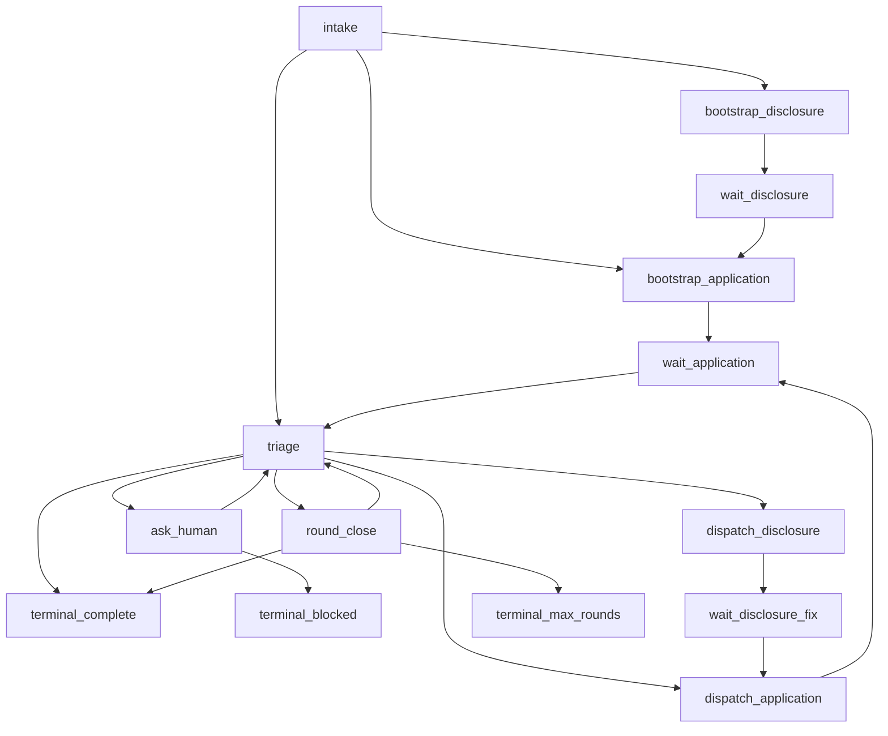

# 阶段图（与 phases.yaml 一致；改跳转只改 yaml）

```mermaid
flowchart TD
  intake --> bootstrap_disclosure
  intake --> bootstrap_application
  intake --> triage
  bootstrap_disclosure --> wait_disclosure
  wait_disclosure --> bootstrap_application
  bootstrap_application --> wait_application
  wait_application --> triage
  triage --> ask_human
  triage --> dispatch_disclosure
  triage --> dispatch_application
  triage --> round_close
  triage --> terminal_complete
  ask_human --> triage
  ask_human --> terminal_blocked
  dispatch_disclosure --> wait_disclosure_fix
  wait_disclosure_fix --> dispatch_application
  dispatch_application --> wait_application
  round_close --> triage
  round_close --> terminal_complete
  round_close --> terminal_max_rounds
```

从零走左边：交底初稿 → 首套申请 → 分诊。满 3 轮或无待办则终端。
